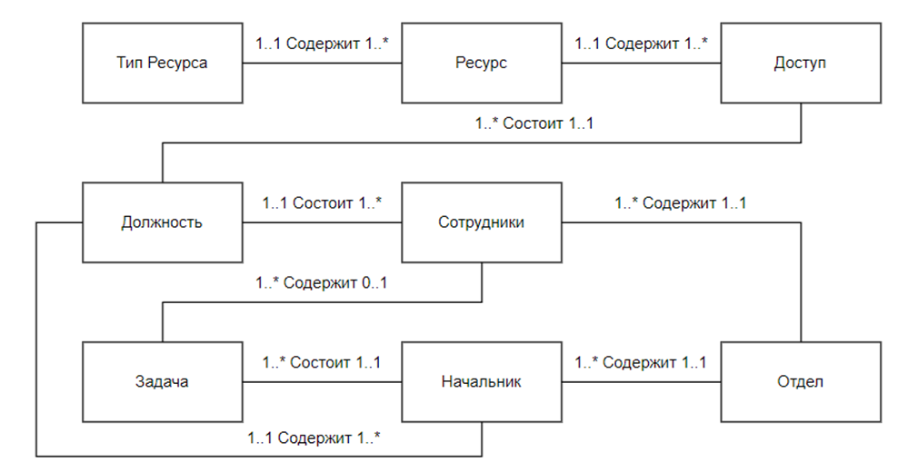
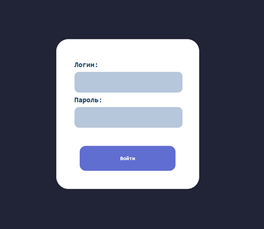
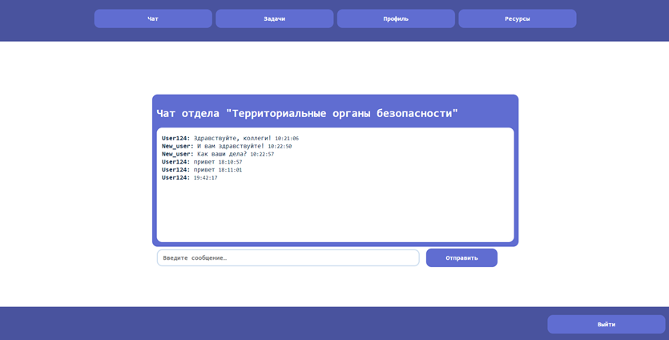
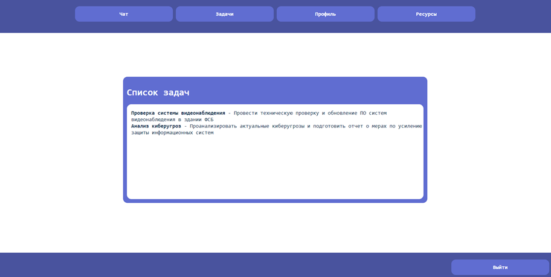
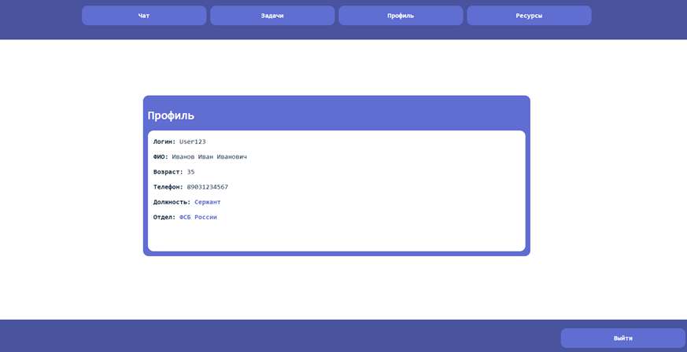
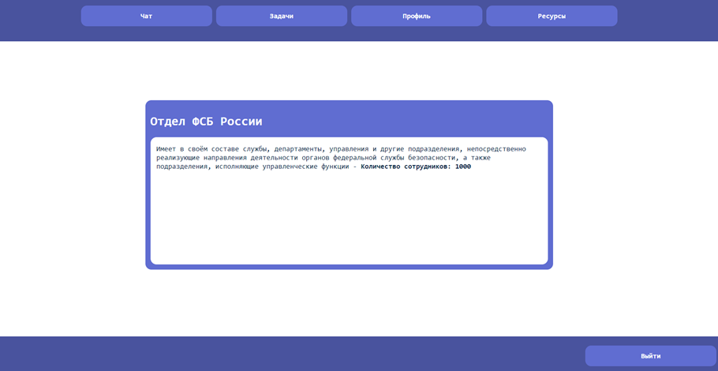
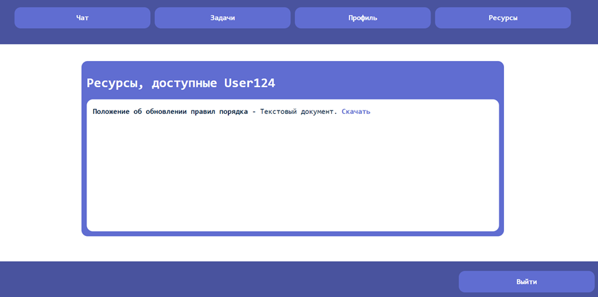

# Gov_security

В данной работе рассмотрена разработка веб-приложения для сотрудников государственных служб с целью обеспечения удобного доступа к информации и взаимодействия между сотрудниками отдела.

**Проблема**: отсутствие удобного веб-приложения для безопасной и единой коммуникации сотрудников государственных служб. Существующие аналоги для коммуникации пользователей часто ограничены своими функциями и не позволяют пользователю иметь все необходимые для работы инструменты в одном проекте.

## Архитектура приложения

Приложение построено на языке программирования Python с использованием фреймворка для веб-разработки Django.

## Структура проекта

В проекте определены различные модели, каждая из которых представляет определенную сущность в контексте приложения. Более подробное рассмотрение каждой модели:

1. **ResourceType:**
    - Модель представляет тип ресурса;
    - Поля: 
        - *resource_type*: Строковое поле, которое хранит название типа ресурса; 
        - *resource_file*: Файл, который приложен к определенному ресурсу.
2. **Resource:**
    - Модель описывает конкретный ресурс, который может быть связан с определенным типом ресурса через внешний ключ;
    - Поля: 
        - *resource_name*: Строковое поле длиной до 50 символов, название ресурса; 
        - *resource_type*: Внешний ключ (ForeignKey) на модель ResourceType, указывающий тип данного ресурса.
3. **Position:**
    - Модель отвечает за должность внутри организации, например, "Рядовой", "Майор" и т.д.;
    - Поля: 
        - *position_name*: Строковое поле длиной до 20 символов, хранит название должности.
4. **Permission:**
    - Модель для управления разрешениями доступа к ресурсам для разных должностей;
    - Поля: 
        - *resource*: Внешний ключ на модель Resource; 
        - *position*: Внешний ключ на модель Position.
5. **Department:**
    - Модель описывает отделы организации;
    - Поля: 
        - *department_name*: Строковое поле, название отдела; 
        - *dep_description*: Текстовое поле (TextField), содержащее описание отдела; 
        - *emp_num*: Целочисленное поле (IntegerField), кол-во сотрудников в отделе.
6. **Head:**
    - Модель руководителя, который относится к определенному департаменту и занимает определенную должность;
    - Поля: 
        - *head_name*: Строковое поле, имя руководителя; 
        - *department*: Внешний ключ на модель Department; 
        - *position*: Внешний ключ на модель Position.
7. **Employee** (наследует от AbstractUser):
    - Модель сотрудника, расширяет стандартную модель пользователя Django.
    - Поля: 
        - *patronymic*: Строковое поле для отчества, необязательное; 
        - *age*: Целочисленное поле для возраста, необязательное; 
        - *phone*: Строковое поле для телефона, уникальное, необязательное; 
        - *position*: Внешний ключ на модель Position; 
        - *department*: Внешний ключ на модель Department.
8. **Task:**
    - Модель задачи, которую должен выполнить сотрудник;
    - Поля: 
        - *task_name*: Наименование задачи; 
        - *task_description*: Описание задачи; 
        - *head*: Внешний ключ на модель Head.
9. **TaskList:**
    - Модель для отслеживания задач, назначенных сотрудникам;
    - Поля: 
        - *task*: Внешний ключ на модель Task; 
        - *employee*: Внешний ключ на модель Employee.
10. **Message:**
    - Модель сообщений, связанных с определенными департаментами.
    - Поля: 
        - *department*: Внешний ключ на модель Department; 
        - *author*: Внешний ключ на пользовательскую модель (User); 
        - *message_text*: Текст сообщения; 
        - *timestamp*: Дата и время создания сообщения.



## Средства безопасности

В проекте используется безопасный способ управления учётными записями пользователей и паролями, избегая распространённых ошибок, таких как размещение информации о сеансе в файлы cookie, где она уязвима (вместо этого файлы cookie содержат только ключ, а фактические данные хранятся в базе данных) или непосредственное хранение паролей вместо хэша пароля.

Обеспечивается защита от многих уязвимостей, включающих SQL-инъекцию. 

Используется хеширование паролей. По умолчанию используется PBKDF2 с хешем SHA256, алгоритм генерации ключа на основе пароля, который может значительно замедлить попытки атак методом перебора. Пароли хранятся не в исходной форме, а в виде хеша, что делает их бесполезными вне контекста приложения.

В проект включены CSRF (Cross-Site Request Forgery) токены для защиты от атак, при которых злоумышленник может заставить пользователя выполнять нежелательные действия на сайте.

## Интерфейс

После входа на сайт выводится страница аутентификации.



После ввода корректного логина и пароля откроется главная страница веб приложения. При попытке неправильного ввода, выведется сообщение об ошибке. 



На главной странице расположен чат пользователей отдела, к которому принадлежит пользователь. На панели навигации располагаются кнопки «Чат», «Задачи», «Профиль», «Ресурсы». Также есть функции отправления сообщения в чат и выхода из аккаунта. При нажатии на кнопку «Задачи» откроется страница задач.



На странице показано окно, в котором выводятся все задачи с их описанием, которые были назначены пользователю. При нажатии на кнопку «Профиль» откроется страница профиля пользователя. 



При нажатии на ссылку в поле «Отдел» откроется страница отдела, к которому принадлежит пользователь.



При нажатии на кнопку «Ресурсы» откроется страница ресурсов с наименованием и типом ресурса, которые доступны пользователю согласно его должности. Нажав на ссылку «Скачать», на устройство установится необходимый файл. 



При нажатии на кнопку «Выйти» произойдет выход из аккаунта и выведется страница аутентификации. 

Весь интерфейс выполнен в едином стиле. Также вся визуальная часть динамичная и изменяется в соответствии с размерами самого окна.

## Запуск

1. Установить репозиторий:

```
git clone git@github.com:fratellou/Gov_security.git
```

2. Перейти в директорию проекта:

```
cd Gov_security/gov_security/
```

3. Установить зависимости:

```
pip install -r requirements.txt
```

4. Создать переменные окружения в файле .env (пример переменных окружения представлен в файле .env.example).

5. Применить миграции:
```
python3 manage.py migrate
```

6. Запустить сервер:

```
python3 manage.py runserver
```
7. Создать суперюзера:
```
python3 manage.py createsuperuser
```
8. Перейти в *http://127.0.0.1:8000/admin* и создать необходимые данные

---
> fratellou, 2024